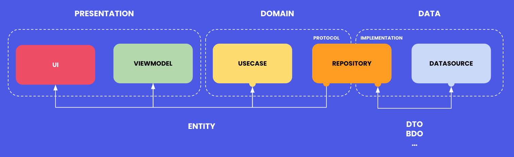

# Ejemplo completo de Clean Architecture MVVM

Se habla mucho de clean architecture y tal vez como a mi os ha pasado que no habéis llegado a entender los por qué detrás de ella.

## Explicación general

Clean architecture no es un concepto nuevo como podemos ver en https://blog.cleancoder.com/uncle-bob/2012/08/13/the-clean-architecture.html . 


Clean Architecture es un enfoque de diseño de software que busca separar la lógica de negocio de los detalles de la implementación técnica. Su objetivo es crear una arquitectura sólida y mantenible que permita una fácil evolución y extensión del sistema con el tiempo.

La arquitectura limpia se basa en la idea de dividir el código en capas independientes de la implementación técnica, lo que permite una mayor independencia de la administración de la infraestructura y los detalles de implementación. Esto mejora la legibilidad del código y facilita la identificación de las partes de la aplicación que deben modificarse para efectuar cambios.

La arquitectura limpia se compone de cuatro capas: 
- La capa de la interfaz de usuario, que interactúa con el usuario final.
- La capa de aplicación, que se encarga de la lógica de negocio de la aplicación.
- La capa de dominio, que contiene las reglas de negocio y los modelos.
- La capa de infraestructura, que se encarga de la conexión de la aplicación con su entorno técnico.


## Estructura del proyecto 

Al igual que la descripción del sistema de capa debe especificar y describir que hace cada uno de estas, debemos trasladar a nuestro proyecto el mismo comportamiento. Para ello crearemos una serie de carpetas que contendrán la lógica de cada uno de estas capas.

### Principales carpetas

Esta seria la distribución de carpetas que contendrán nuestro proyecto.

```
├── Core
├── Data
├── DI
├── Domain
└── Presentation
```

## Visión detallada y descripción

Cada uno estos componentes tiene una función y no deben mezclarse entre ellos. Teniendo claro donde debe de ir cada una de las lógicas que implementemos.

```
├── Core
├── Data
|   ├── DataSource
|   ├── DTO
│   └── Repository
├── Di
├── Domain
│    ├── UseCase
│    └── Entity
└── Presentation
    ├── App
    └── Modules
```

- **Core**: esta capa se encarga de almacenar todos aquellos componentes que sean comunes a todas las capas. Por ejemplo: Constantes, datos de configuración etc.

- **Data**: esta capa es la que contendrá todos los componentes que se encarguen de obtener y almacenar información.
    - **DataSource**: Es el mecanismo por el cual obtenemos el dato de una fuente concreta.
    - **DTO**: almacenaremos todos los Data Transfer Object (DTO).
    - **Repository**: contiene todas implementaciones para obtener datos ya sea de una API o de una base de datos.
    
- **DI**: esta capa contiene la inyección de dependencias de nuestro proyecto que se utiliza a lo largo de la app. En nuestro caso contendrá el Container.swift que contine todas las dependencias del proyecto.

- **Domain**: esta capa se encarga de definir entidades y casos de uso por Dominio.
    - **Entity**: son modelos utilizados más allá de los DTO para gestionar base de datos o core data.
    - **UseCase**: Lista todas las funcionalidades de nuestra aplicación. Ejemplo: Get, Delete, Create , Update.
    
- **Presentation**: La capa de presentación mantendrá todo lo relacionado con UI y su gestión.

## Capa de presentación - Modules

Cada módulo esta compuesto por una serie de ficheros que deben ser implementados en cada uno de ellos.

```
└── Presentation
    └── Modules
        ├── ToDoBuilder
        ├── ToDoProtocols
        ├── ToDoRouter
        ├── ToDoViewModel
        ├── ToDoViewController
        └── ToDoViewController(UI)
```

- **Builder**: constructor del viewController y sus dependencias

- **Protocols**: responsable de declarar todos los protocolos que se usarán en la aplicación   

- **Router**: responsable de la navegación por parte del controlador

- **ViewController**: controlador de la UI para gestionar la lógica del módulo

- **ViewController(UI)**: capa visual del controlador

## Uso de la arquitectura



La imagen describe el proceso de obtención de información y como esta se transmite a lo largo de los modulos. 

El `repository` es el encargado de obtener el dato ya sea de una API, base de datos local o cualquier otra fuente de datos.

El `use case` es el responsable de realizar las operaciones necesarias para devolver la información ya tratada al viewModel. 
Contiene un conjunto de soluciones a diversas situaciones y cada una de ellas resuelve una y sólo una tarea en particular, resolviendo todas sus dependencias para poder ser ejecutada.

El `viewModel` obtiene la información previamente tratada por el use case y ejecuta las funciones que sean necesarias y notifica al `viewController` para que realice los cambios de UI.

El `viewController` es el responsable de ejecutar las acciones relacionadas con el UI


## Autor

Fernando Salom

https://fernandosalom.es

https://www.linkedin.com/in/fsalom/

## Licencia
[MIT](https://choosealicense.com/licenses/mit/)
